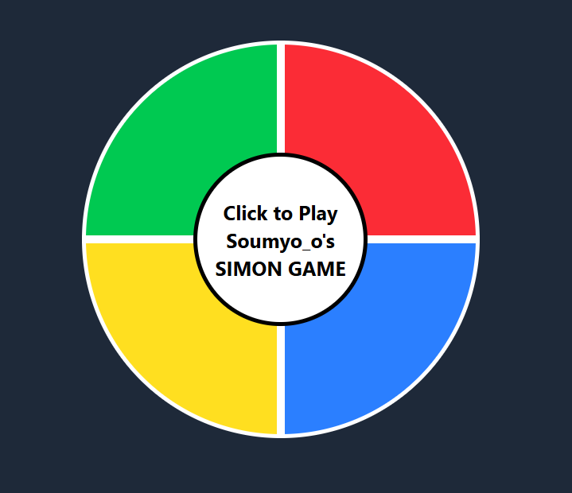

# 🎮 Soumyo_o's Simon Game

[](https://soumyoo.github.io/SIMON-GAME/){:target="_blank"}

A classic memory-based color pattern game built with **React**, **Tailwind CSS**, and React Hooks. The game challenges players to repeat an ever-growing sequence of colors. How long can you keep up?

## 🧠 Game Rules

1. Click the **center button** to start the game.
2. The game will highlight a **random color**.
3. Repeat the sequence by clicking the buttons in **correct order**.
4. Each round adds **one more color** to the sequence.
5. If you click the **wrong color**, the game ends and displays your **score**.
6. Click the center button again to **restart**.

---

## 📦 Installation & Setup

1. **Clone the repository**  
   ```bash
   git clone https://github.com/soumyoo/SIMON-GAME.git
   cd simon-game
   npm install
   npm run dev